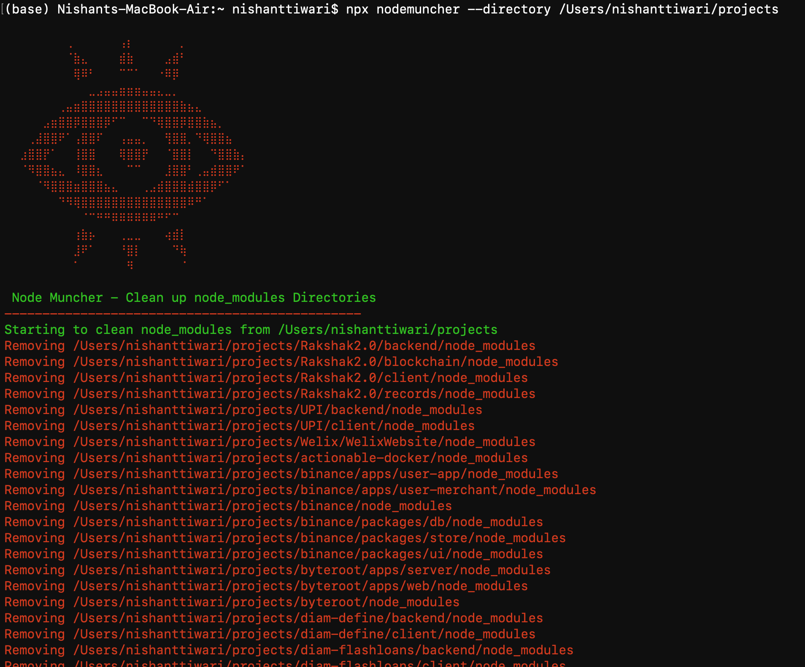

**NodeMuncher** is a powerful and user-friendly CLI tool designed to help developers keep their projects clean and clutter-free. It specializes in locating and removing all `node_modules` directories within a specified path, making it easier to manage and maintain your codebase.



### Usage:
To get started with NodeMuncher, simply install it globally via npm and run the command with your desired directory:

### Package Details:
```bash
npm-package-version: 1.1.1
npm-package-name: nodemuncher
```

### Installation:
```bash
npm install -g nodemuncher
```
If you encounter permission issues, use:
```bash
sudo npm install -g nodemuncher
```

### Running NodeMuncher:
```bash
npx nodemuncher --directory ./path/to/your/project
```
If you want to target the current directory, simply omit the path:
```bash
npx nodemuncher --directory .
```
